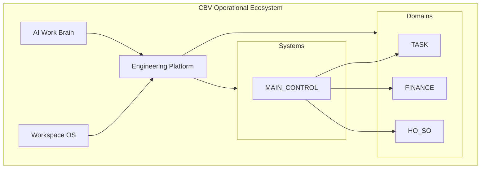

# Kiến trúc CBV Operational Ecosystem

## 1. Tầng nhìn tổng thể

## 2. Luồng dữ liệu khái niệm

1. **Người dùng** tương tác AppSheet / Webapp.
2. **Apps Script** thực thi nghiệp vụ, gọi API Google / webhook / thư viện nội bộ.
3. **MAIN_CONTROL** điều phối trạng thái và phân quyền giữa các domain.
4. **AI Work Brain** không nằm trên đường nóng xử lý giao dịch; nó ghi nhận prompt/report/handoff để cải tiến liên tục.

## 3. Phân tách runtime

| Runtime | Mô tả |
|---------|--------|
| Business | AppSheet + Sheets + Apps Script production + webapp user-facing. |
| Test | Test console + suite automation + dữ liệu fixture — tách biệt dữ liệu thật. |
| AI | `ai-runtime/` + `00_SYSTEM_BRAIN/` — artifact của AI, không là nguồn sự thật cho số dư tài chính. |

## 4. Thành phần repo chính

- **Chuẩn & kiến trúc**: `docs/`
- **Triển khai script**: `apps-script/`, `webapp/`
- **Cấu hình**: `config/`
- **Kiểm thử**: `tests/`
- **Vận hành AI**: `ai-runtime/`, `00_SYSTEM_BRAIN/`

## 5. Liên kết chi tiết

- Nền tảng kỹ thuật: `CBV_ENGINEERING_PLATFORM_ARCHITECTURE.md`
- Workspace OS: `CBV_WORKSPACE_OS_ARCHITECTURE.md`
